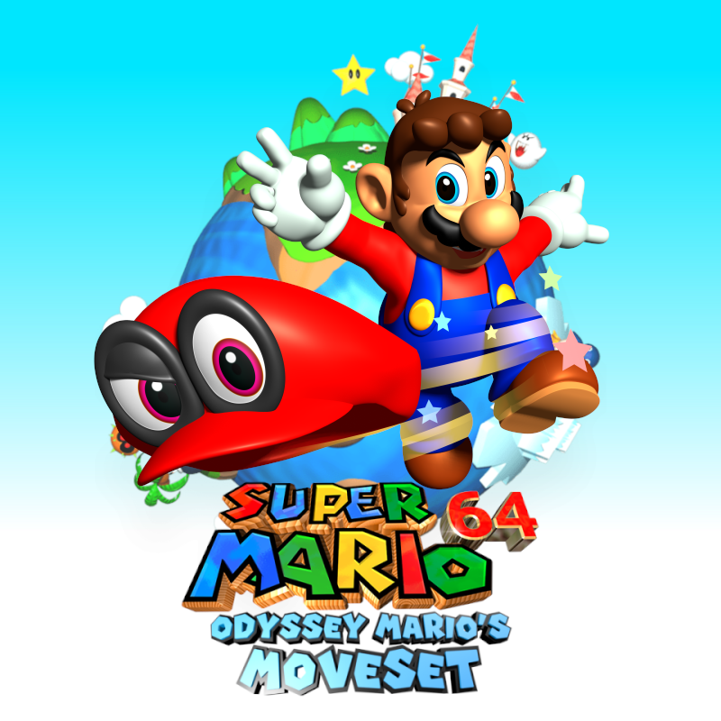

# Odyssey Mario's Moveset
**Mod exclusively for the *Super Mario 64 PC Port*, developed by PeachyPeach.**



-----

## Build the game with *OMM Builder*

*OMM Builder* is a terminal-styled GUI packaged as a Python script that makes the building process of the *Odyssey Mario's Moveset* mod simpler, while allowing some customization.

---

## Installing the builder

[Windows](https://github.com/PeachyPeachSM64/sm64ex-omm?tab=readme-ov-file#windows)<br>
[Linux (Ubuntu)](https://github.com/PeachyPeachSM64/sm64ex-omm?tab=readme-ov-file#linux-ubuntu)<br>
[Linux (Debian)](https://github.com/PeachyPeachSM64/sm64ex-omm?tab=readme-ov-file#linux-debian)<br>
[Linux (Fedora)](https://github.com/PeachyPeachSM64/sm64ex-omm?tab=readme-ov-file#linux-fedora)<br>
[Arch Linux](https://github.com/PeachyPeachSM64/sm64ex-omm?tab=readme-ov-file#arch-linux)

### Windows

- Download the [OMM Builder Setup Script](https://github.com/PeachyPeachSM64/sm64ex-omm-resources/raw/master/scripts/scripts.zip).

- Extract the `.zip` archive and execute `omm_builder_setup.bat`. It will install everything needed for the builder to work.

- Once done, open the folder `sm64ex-omm` and place your copy of the **Super Mario 64 US ROM** inside it, next to the Python script `omm_builder.py`.

### Linux (Ubuntu)

- Open a terminal and run the following commands to install the required packages:
```
sudo apt-get update -y
sudo apt install build-essential git python3 libglew-dev libsdl2-dev libz-dev libaudiofile-dev zip p7zip*
```

- Install the builder by cloning the *builder* branch with this command:
```
git clone --single-branch --depth 1 https://github.com/PeachyPeachSM64/sm64ex-omm.git -b builder sm64ex-omm
```

- Once done, open the directory `sm64ex-omm` and place your copy of the **Super Mario 64 US ROM** inside it, next to the Python script `omm_builder.py`.

### Linux (Debian)

- Open a terminal and run the following commands to install the required packages:
```
sudo apt-get update -y
sudo apt install -y build-essential bsdmainutils git python3 libglew-dev libsdl2-dev libz-dev libaudiofile-dev zip p7zip*
```

- Install the builder by cloning the *builder* branch with this command:
```
git clone --single-branch --depth 1 https://github.com/PeachyPeachSM64/sm64ex-omm.git -b builder sm64ex-omm
```

- Once done, open the directory `sm64ex-omm` and place your copy of the **Super Mario 64 US ROM** inside it, next to the Python script `omm_builder.py`.

### Linux (Fedora)

- Open a terminal and run the following commands to install the required packages:
```
sudo dnf install --assumeyes util-linux git-all make gcc gcc-c++ python3 glew-devel SDL2-devel zlib-devel zip unzip p7zip p7zip-plugins wget audiofile-devel
```

- Install the builder by cloning the *builder* branch with this command:
```
git clone --single-branch --depth 1 https://github.com/PeachyPeachSM64/sm64ex-omm.git -b builder sm64ex-omm
```

- Once done, open the directory `sm64ex-omm` and place your copy of the **Super Mario 64 US ROM** inside it, next to the Python script `omm_builder.py`.

### Arch Linux

- Open a terminal and run the following commands to install the required packages:
```
sudo pacman -Syu --noconfirm
sudo pacman -S --noconfirm base-devel git python sdl2 glew zip unzip wget p7zip audiofile
```

- Install the builder by cloning the *builder* branch with this command:
```
git clone --single-branch --depth 1 https://github.com/PeachyPeachSM64/sm64ex-omm.git -b builder sm64ex-omm
```

- Once done, open the directory `sm64ex-omm` and place your copy of the **Super Mario 64 US ROM** inside it, next to the Python script `omm_builder.py`.

---

## Building the game

Start *OMM Builder* with the command `python3 omm_builder.py` in a terminal, or launch the start-up script `omm_builder.bat` (Windows only).

Use <kbd>E</kbd>, <kbd>S</kbd>, <kbd>D</kbd>, <kbd>F</kbd> to move, <kbd>C</kbd> to go to the next view and <kbd>X</kbd> to come back.<br>
Additionally, you can use digits from <kbd>1</kbd> to <kbd>9</kbd> to select instantly the desired option and <kbd>0</kbd> to go back to the previous view.


The main views are the following:
```
omm_builder.py
└── Games
    └── Commands
        ├── Run
        ├── Clear
        ├── Reset
        ├── Delete
        └── Build
            ├── Build Speed
            ├── Render API
            ├── DynOS
            ├── Patches
            ├── Texture Packs
            ├── Sound Packs
            ├── Model Packs
            ├── Audio Packs
            └── Build and Run
```

Games that can be built with *Odyssey Mario's Moveset*:
1. - ***Super Mario 64 ex-nightly***
2. - ***Super Mario 64 Moonshine***
3. - ***Super Mario 74***
4. - ***Super Mario Star Road***
5. - ***Super Mario 64: The Green Stars***
6. - ***Render96***

---

## Build the game with *sm64pcBuilder2*

If you want more customization or simply build the game the usual way, download the [OMM patch file](https://raw.githubusercontent.com/PeachyPeachSM64/sm64ex-omm/patch/omm.patch) and add it in **sm64pcBuilder2**.

---

## [Frequently Asked Questions](faq.md)

---

## *Odyssey Mario's Moveset* content and media

- [Official Discord server](https://discord.gg/tmqsQhZdhJ)
- [Speedrun leaderboard](https://www.speedrun.com/omm) by **JokerFactor**, **SwaGh**, **Mr.Needlemouse**
- [Player's Almanach](https://docs.google.com/document/d/1IlhCxYGulxrnbvqbSuBMC1JgtBIEwoCcK3l-urVUADk) by **Cancel the Eat**
- [Movement Guide](https://www.youtube.com/watch?v=xVvl9tYUbgA) by **Key's Artworks**
- [Pink Gold Stars guide](https://www.youtube.com/watch?v=sPhx7hDPLKs) by **FastMario**
- [Sparkly Stars guide](https://www.youtube.com/watch?v=xWHKPV-cbqI&list=PLFZ-DGZKGuUo3KuXfGoaP55RYiDXgxE8N) by **Cancel the Eat**
- [Sparkly Stars 0x A-press Challenge](https://www.youtube.com/watch?v=fW23xKMVm9Y) by **Key's Artworks**

---

## Useful resources

- [OMM patch file](https://raw.githubusercontent.com/PeachyPeachSM64/sm64ex-omm/patch/omm.patch) (Right click -> `Save As...`)
- [sm64pcBuilder2](https://sm64pc.info/sm64pcbuilder2/) by **gunvalk**, **Filipianosol**, **GammaTendonNine**
- [Super Mario 64 Moonshine archive](https://www.mediafire.com/file/khy40tbd1rcve2p/MOONSHINE_FINALUPDATE.rar/file) by **TurnFlashed**, **s4ys**, **Fito**
- [Super Mario 74 HD Texture pack](https://github.com/aspieweeb759/Super-Mario-74-HD-Texture-Pack) by **sarah_taylor**
- [Super Mario Star Road HD Texture pack](https://github.com/aspieweeb759/Star-Road-HD) by **sarah_taylor**
- [Render96 Texture pack](https://github.com/pokeheadroom/RENDER96-HD-TEXTURE-PACK) by **Render96 Team**
- [Render96 Model pack](https://github.com/Render96/ModelPack/releases/tag/3.2) by **Render96 Team**
- [Render96 characters with color support](https://github.com/PeachyPeachSM64/sm64ex-omm-resources/tree/master/packs) by **Render96 Team**
- [Custom patches](https://sm64pc.info/downloads/patches/)
- [Texture packs](https://sm64pc.info/downloads/texture_pack/)
- [Sound packs](https://sm64pc.info/downloads/sound_pack/)
- [Model packs](https://sm64pc.info/downloads/model_pack/)
