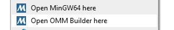
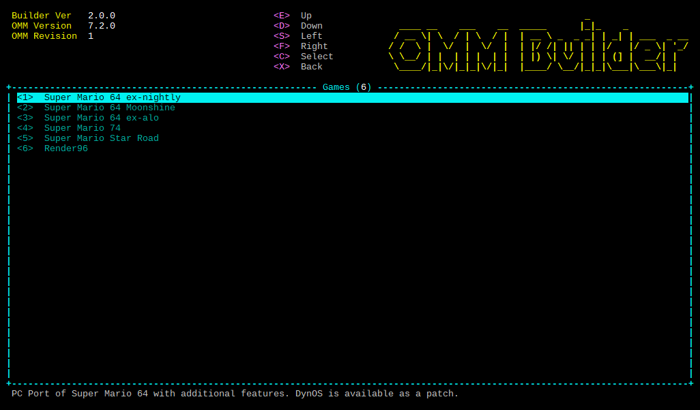

# Odyssey Mario's Moveset
**Mod exclusively for the *Super Mario 64 PC Port*, developed by PeachyPeach.**

-----

## Build the game with *OMM Builder*

*OMM Builder* is a terminal-styled GUI packaged as a Python script that makes the building process of the *Odyssey Mario's Moveset* mod simplier, while allowing some customization.

```diff
- IMPORTANT NOTICE:
- Cloning the `sm64ex-omm` repository from PeachyPeachSM64's github is the only way to get the builder.
- Never download or execute the file `omm_builder.py` from any other source, even trusted ones, as it's
- likely to contain malicious code that can irremediably harm your computer or steal your personal data.
```

---

### Installing the builder:

- **Windows**:

  - Download the [OMM Builder Setup Script](https://github.com/PeachyPeachSM64/sm64ex-omm-resources/raw/master/scripts.zip).

  - Extract the `.zip` archive and execute `omm_builder_setup.bat`. It will install everything needed for the builder to work.<br>***Note:*** *Running this script as administrator will enable the options `Open MinGW64 here` and `Open OMM Builder here` in the Explorer context menu (right click).*<br>
  

  - Once done, open the folder `sm64ex-omm` and place your copy of the **Super Mario 64 US ROM** inside it, next to the Python script `omm_builder.py`, and rename it `baserom.us.z64`.

- **Linux**:

  - Open a terminal and run the following command to install the required packages:<br>`sudo apt install build-essential git python3 libglew-dev libsdl2-dev zip p7zip*`

  - Install the builder by cloning the *builder* branch with this command:<br>`git clone --single-branch --depth 1 https://github.com/PeachyPeachSM64/sm64ex-omm.git -b builder sm64ex-omm`

  - Once done, open the directory `sm64ex-omm` and place your copy of the **Super Mario 64 US ROM** inside it, next to the Python script `omm_builder.py`, and rename it `baserom.us.z64`.

---

### Building the game:

*OMM Builder* is a terminal-styled GUI. Start it with the command `python3 omm_builder.py`, or launch the start-up script `omm_builder.bat` (Windows only).

Use <kbd>E</kbd>, <kbd>S</kbd>, <kbd>D</kbd>, <kbd>F</kbd> to move, <kbd>C</kbd> to go to the next view and <kbd>X</kbd> to come back.<br>Additionally, you can use digits from <kbd>1</kbd> to <kbd>9</kbd> to select instantly the desired option and <kbd>0</kbd> to go back to the previous view.



The main views are the following:
```
omm_builder.py
└── Games
    └── Commands
        ├── Run
        ├── Clear
        ├── Reset
        ├── Delete
        └── Build
            ├── Build Speed
            ├── Render API
            ├── DynOS
            ├── Patches
            ├── Texture Packs
            ├── Sound Packs
            ├── Model Packs
            ├── Audio Packs
            └── Build and Run
```

Games that can be built with *Odyssey Mario's Moveset*:
1. - ***Super Mario 64 ex-nightly***
2. - ***Super Mario 64 ex-alo***
3. - ***Super Mario 64 Moonshine***
4. - ***Super Mario 74***
5. - ***Super Mario Star Road***
6. - ***Super Mario 64: The Green Stars***
7. - ***Render96***

---

### Requirements

- To build ***Super Mario 64 Moonshine***, extract the mod archive content (`MOONSHINE_FINALUPDATE.rar`) into the `moonshine` directory.

### Custom resources

- Put your custom resources (Patches, Texture packs, Sound packs, Model packs, Audio packs) into the `custom` directory.<br>Upon running, *OMM Builder* will detect automatically the custom resources and their type.

### Downloadable resources

- Some resources can be downloaded automatically by the program if they are selected when building the game:
  - DynOS Patch
  - Time Trials Patch
  - OMM-HD Texture pack
  - Render96-HD Texture pack
  - Render96 Model pack

---

## Build the game with *sm64pcBuilder2*

If you want more customization or simply build the game the usual way, download the *Odyssey Mario's Moveset* [patch file](https://raw.githubusercontent.com/PeachyPeachSM64/sm64ex-omm/patch/omm.patch) and add it in **sm64pcBuilder2**.

---

## Q&A

### The game is built successfully, but the only thing I get when launching it is a black screen...

You probably built the game with a renderer not supported by your computer.<br>Delete your build and try again by changing the `Render API` option from `OpenGL 2.1` to `DirectX 11`.

### Where did my executable go?

- **Windows**: `repos/<game>/build/us_pc/sm64.us.f3dex2e.exe`
- **Linux**: `repos/<game>/build/us_pc/sm64.us.f3dex2e`

Once built, the game executable is located in the `build/us_pc` directory of the game you choose.<br>If you want to copy or move it, make sure to copy/move the entire `build/us_pc` directory, not only the executable file.

### Why is the Texture pack I installed not visible in-game?

- Make sure the Texture pack is in the `res` directory and is a valid `.zip` archive.
- If there is a `gfx.raw` file in the `res` directory, delete it, or change the in-game option `Texture Caching` from `Permanent` to `At Start-up`.

### Why is the Model pack I installed not visible in-game?

- Make sure the Model pack is in the `res/packs` or `dynos/packs` directory and is a valid pack (directory of `.bin` files).
- In-game, open the `Model Packs` option menu and enable your model pack.

### Where is the save file located? How do I open/edit it?

- **Windows**: `%appdata%\sm64ex\omm_save_file.txt`
- **Linux**: `~/.local/share/sm64ex/omm_save_file.txt`

The save file is a plain text file, so any text editor can open it. It is divided in multiple sections:
- `[xxxx:yy]`: The main game save data. `xxxx` is the game name, `yy` is the save slot.
  - Flags: 0 = locked and 1 = unlocked.
  - Courses: the first 7 numbers are the stars (1 = collected, 0 = not), the next number is the cannon (1 = open, 0 = closed) and the last number is the coin score.
- `[sparkly_stars]`: The Sparkly Stars save data. It cannot be edited directly.
- `[mario_colors]`, `[peach_colors]`: The custom palettes for playable characters.
  - Each `mario_custom` (`peach_custom`) entry consists of 7 (8) pairs of RGB values in hexadecimal form + a palette name.
  - The first value of a pair is the ambient color, the second is the diffuse color.
  - For Mario, the colors are in the following order: *Cap*, *Hair*, *Skin*, *Gloves*, *Overalls*, *Shoes*, *Cappy Eyes*.
  - For Peach, the colors are in the following order: *Skin*, *Hair*, *Dress (light tone)*, *Dress (dark tone)*, *Gloves*, *Earrings*, *Shoes*, *Tiara Eyes*.
  - The palette name cannot have spaces, replace them by underscores.
- `[stats]`: Several in-game stats, such as number of objects collected, number of enemies defeated, distance travelled, etc...
- `[settings]`: The saved options. It includes controls, shortcuts and extras.

### What is the options menu?

A PC port exclusivity, the options menu allows the player to configure their game without relying on code modifications, patches or external tools.<br>The options menu can be accessed by pausing the game, then pressing <kbd>RSHIFT</kbd> (keyboard) or <kbd>**R**</kbd> (controller).
- `Odyssey Mario's Moveset`:
  - `Character`: Mario, Peach (if unlocked), Luigi or Wario (***Render96*** only).
  - `Moveset`: Classic, Odyssey (3-Health), Odyssey (6-Health), Odyssey (1-Health).
  - `Cap`: Classic, Cappy (No Capture), Cappy (Capture-Press), Cappy (Capture-Hold).
  - `Stars`: Classic, Non-Stop.
  - `Power-ups`: Classic, Improved.
  - `Camera`: Classic, 8-Dir, 16-Dir.
  - `Sparkly Stars`:
    - `Mode`: Disabled, Normal, Hard.
    - `Show Hint at Level Entry`: Always, Only If Not Collected, Never.
  - `Cheats`:
    - `Unlimited Cappy Bounces`: Mario can bounce infinitely on Cappy.
    - `Cappy Stays Forever`: Cappy no longer returns to Mario after some time.
    - `Homing Attack Global Range`: Extend Cappy's homing attack range to the whole level.
    - `Mario Teleports to Cappy`: Press **(X)** again after throwing Cappy to teleport Mario to him.
    - `Cappy Can Collect Stars`: Cappy can interact and give stars and keys to Mario.
    - `Play As Cappy`: Throw Cappy to control him. Hold **(A)** to go up, **(B)** to go down and press **(X)** to return to Mario.
    - `Peach Endless Vibe Gauge`: Peach only. Vibes no longer depletes the Vibe gauge.
    - `Shadow Mario`: Turns Mario into Shadow Mario.
  - `Extras`:
    - `Mario Colors`: Select a color palette for Mario. The last 4 are customizable.
    - `Peach Colors`: Select a color palette for Peach. The last 4 are customizable.
    - `Super Mario Odyssey Animations`: If enabled, replace some of the vanilla animations with animations from *Super Mario Odyssey*.
    - `Cappy and Tiara`: If enabled, replace Mario's cap by Cappy and Peach's crown by Tiara.
    - `Colored Stars`: If enabled, give each level stars a specific color, like moons in *Super Mario Odyssey*.
    - `Vanishing HUD`: If enabled, make the HUD progressively vanish when Mario is moving.
    - `Reveal Secrets`: If enabled, make the secrets visible.
    - `Red Coins Radar`: If enabled, locate and show the direction of the nearest red coin.
    - `Show Star Number`: If enabled, show for each star its number.
    - `Invisible Mode`: If enabled, make Mario, Cappy, Peach, Tiara and their effects invisible.
  - `Shortcuts`: Allow the player to bind up to three keys/buttons for a bunch of options.
- `Game` (***Render96*** only):
  - `Current Language`: Set the current language.
  - `Disable Billboards`: Don't force objects to face the camera. Must be enabled if the *Render96 Model Pack* is installed.
- `Camera`:
  - `Free Camera`/`Puppycam 2`: A modern game camera designed to be more comfortable.
  - `Analogue Camera`: Turn on or off the analogue camera.
  - `Mouse Look`: Allow the player to move the camera with their mouse.
  - `Invert X Axis`: Invert the horizontal rotation of the camera.
  - `Invert Y Axis`: Invert the vertical rotation of the camera.
  - `Camera X Sensitivity`: Control the horizontal movement speed of the camera.
  - `Camera Y Sensitivity`: Control the vertical movement speed of the camera.
  - `Camera Deceleration`: Control the movement deceleration of the camera.
- `Controls`:
  - Binds: Allow the player to bind up to three keys/buttons for each N64 button.
  - `Stick Deadzone`: The left-stick deadzone.
  - `Reset Controls`: Reset the controls back to default.
- `Display`:
  - `Frame Rate`: Set the framerate. Does not affect game updates, they still run 30 times per second.
    - `30`: No frame interpolation.
    - `60`: Enable frame interpolation to make the game render at a constant 60 FPS.
    - `Auto`: Synchronize the framerate with the monitor's refresh rate.
    - `Unlimited`: Render as much frames as possible.
  - `Show FPS`: If enabled, show the actual framerate in the bottom-left corner of the screen.
  - `Fullscreen`: Enable fullscreen mode.
  - `Vertical Sync`: Synchronize the render rate with the monitor's refresh rate. Enable it if you're experiencing tearing.
  - `Texture Caching`: Preload and cache all textures when starting the game to avoid in-game freezes due to texture loading.
    - `Disabled`: Never preload textures.
    - `At Start-up`: Load all textures present in the `res` directory every time the game starts.
    - `Permanent`: Load all textures once and cache them permanently.
  - `Texture Filtering`: Set to nearest neighbor for blocky effects, or linear for smooth but blurry effects.
  - `Draw Distance`: Control the rendering distance of objects. Reduce it if you're experiencing slowdowns.
  - `HUD`: Show or hide the HUD.
- `Sound`:
  - `Master Volume`: The general volume setting.
  - `Music Volume`: The volume of background music.
  - `SFX Volume`: The volume of sound effects.
  - `ENV Volume`: The volume of environment sounds (birds chirping, water flowing, etc...).
- `Cheats`: A list of built-in modifications that gives Mario super-human powers, such as Moon-jumping, Infinite health, the ability to BLJ anywhere and much more.

### What are the default keyboard/controller controls?

| | Keyboard (qwerty) | Keyboard (azerty) | XBox One Controller | Switch Pro Controller |
|:-:|:-:|:-:|:-:|:-:|
| A Button | <kbd>L</kbd> | <kbd>L</kbd> | <kbd>**A**</kbd> | <kbd>**A**</kbd> |
| B Button | <kbd>,</kbd> | <kbd>;</kbd> | <kbd>**B**</kbd> | <kbd>**B**</kbd> |
| X Button | <kbd>K</kbd> | <kbd>K</kbd> | <kbd>**X**</kbd> | <kbd>**X**</kbd> |
| Y Button | <kbd>M</kbd> | <kbd>,</kbd> | <kbd>**Y**</kbd> | <kbd>**Y**</kbd> |
| Start Button | <kbd>SPACE</kbd> | <kbd>SPACE</kbd> | <kbd>**Start**</kbd> | <kbd>**+**</kbd> |
| Spin Button | <kbd>Mouse Wheel Button</kbd> | <kbd>Mouse Wheel Button</kbd> | <kbd>**LS-Button**</kbd> | <kbd>**LS-Button**</kbd> |
| L Trigger | <kbd>LSHIFT</kbd> | <kbd>LSHIFT</kbd> | <kbd>**LB**</kbd> | <kbd>**L**</kbd> |
| R Trigger | <kbd>RSHIFT</kbd> | <kbd>RSHIFT</kbd> | <kbd>**RB**</kbd> | <kbd>**R**</kbd> |
| Z Trigger | <kbd>O</kbd> | <kbd>O</kbd> | <kbd>**RT**</kbd> | <kbd>**ZR**</kbd> |
| C-Up | <kbd>&uarr;</kbd> | <kbd>&uarr;</kbd> | <kbd>**RS-Up**</kbd> | <kbd>**RS-Up**</kbd> |
| C-Down | <kbd>&darr;</kbd> | <kbd>&darr;</kbd> | <kbd>**RS-Down**</kbd> | <kbd>**RS-Down**</kbd> |
| C-Left | <kbd>&larr;</kbd> | <kbd>&larr;</kbd> | <kbd>**RS-Left**</kbd> | <kbd>**RS-Left**</kbd> |
| C-Right | <kbd>&rarr;</kbd> | <kbd>&rarr;</kbd> | <kbd>**RS-Right**</kbd> | <kbd>**RS-Right**</kbd> |
| D-Up | <kbd>-</kbd> | <kbd>)</kbd> | <kbd>**D-Up**</kbd> | <kbd>**D-Up**</kbd> |
| D-Down | <kbd>{</kbd> | <kbd>^</kbd> | <kbd>**D-Down**</kbd> | <kbd>**D-Down**</kbd> |
| D-Left | <kbd>P</kbd> | <kbd>P</kbd> | <kbd>**D-Left**</kbd> | <kbd>**D-Left**</kbd> |
| D-Right | <kbd>}</kbd> | <kbd>$</kbd> | <kbd>**D-Right**</kbd> | <kbd>**D-Right**</kbd> |
| Stick Up | <kbd>W</kbd> | <kbd>Z</kbd> | <kbd>**LS-Up**</kbd> | <kbd>**LS-Up**</kbd> |
| Stick Down | <kbd>S</kbd> | <kbd>S</kbd> | <kbd>**LS-Down**</kbd> | <kbd>**LS-Down**</kbd> |
| Stick Left | <kbd>A</kbd> | <kbd>Q</kbd> | <kbd>**LS-Left**</kbd> | <kbd>**LS-Left**</kbd> |
| Stick Right | <kbd>D</kbd> | <kbd>D</kbd> | <kbd>**LS-Right**</kbd> | <kbd>**LS-Right**</kbd> |

### How do I update *OMM Builder*/*Odyssey Mario's Moveset*?

If it detects a new version, the builder will ask you if you want to update it when you launch it.<br>As for the *Odyssey Mario's Moveset* mod, the files are automatically updated when building a game.

---

## Speedrunning

For speedrunners, *Odyssey Mario's Moveset* comes with a LiveSplit auto-splitter.<br>It works with every game that can be built with *Odyssey Mario's Moveset*.

An auto-splitter is a script, a small program, that runs through LiveSplit and does the splits automatically, so the player doesn't need to press a key or a button to trigger each one.<br>What it does in *Super Mario 64* is fairly simple:
- Starts the timer when the player selects a file,
- Splits each time a specific amount of stars is collected,
- Stops when the Grand Star is collected at the end of a run, or when the last split is triggered,
- Resets when the player returns to the main menu.

To install it and make it work, follow these steps:
- Your *Odyssey Mario's Moveset* version must be **6.1.0** or later.
- Open LiveSplit, and load your splits. Make sure they follow this format:
  - For star splits, you must indicate the amount of stars needed in brackets:
    - Use square brackets to split upon star collection: `[20]`.
    - Use parentheses to delay the split until the level exit: `(20)`.
  - If a split has `Bowser` in its name but no star amount, it is interpreted as a Bowser key split or a Grand Star split and the split is triggered on key/star collection.
  - If the final split has no star amount, it is interpreted as a Grand Star split (i.e. after defeating the last Bowser) and immediately stops the timer.
- Right click, select `Save Splits As...` and save them as a `splits.lss` file next to the `sm64.us.f3dex2e.exe` executable.
- Right click again, and select `Edit Layout...`.
- Add a `Scriptable Auto Splitter`, double-click on it, and select `Browse...`.
- Navigate to the *OMM Builder* directory and select the file `omm.asl`.
- Press `OK` twice, then start the game. The timer should start as soon as an **empty** save file is selected.

---

## *Odyssey Mario's Moveset* content

- [Releases](https://www.omm.lol/downloads)
- [Patch file](https://raw.githubusercontent.com/PeachyPeachSM64/sm64ex-omm/patch/omm.patch) (Right click -> `Save As...`)
- [Player's Almanach](https://docs.google.com/document/d/1IlhCxYGulxrnbvqbSuBMC1JgtBIEwoCcK3l-urVUADk) (by **Cancel the Eat**)
- [Sparkly Stars guide](https://www.youtube.com/watch?v=xWHKPV-cbqI&list=PLFZ-DGZKGuUo3KuXfGoaP55RYiDXgxE8N) (by **Cancel the Eat**)
- [Pink Gold Stars guide](https://www.youtube.com/watch?v=sPhx7hDPLKs) (by **FastMario**)
- [Speedrun leaderboard](https://www.speedrun.com/omm) (by **JokerFactor**, **SwaGh**, **Mr.Needlemouse**)
- [Official Discord server](https://discord.gg/tmqsQhZdhJ)

---

## Useful resources

- [sm64pcBuilder2](https://sm64pc.info/sm64pcbuilder2/) (by **gunvalk**, **Filipianosol**, **GammaTendonNine**)
- [Super Mario 64 Moonshine archive](https://www.mediafire.com/file/khy40tbd1rcve2p/MOONSHINE_FINALUPDATE.rar/file) (by **TurnFlashed**, **s4ys**, **Fito**)
- [Super Mario Star Road HD Texture pack](https://github.com/aspieweeb759/Star-Road-HD) (by **sarah_taylor**)
- [Custom patches](https://sm64pc.info/downloads/patches/)
- [Texture packs](https://sm64pc.info/downloads/texture_pack/)
- [Sound packs](https://sm64pc.info/downloads/sound_pack/)
- [Model packs](https://sm64pc.info/downloads/model_pack/)
