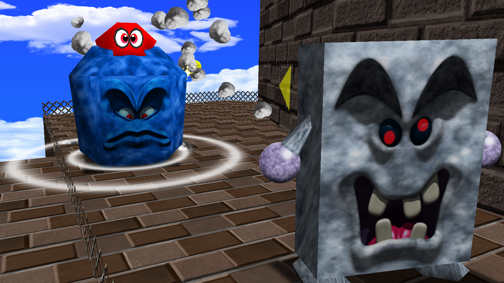

# Odyssey Mario's Moveset
**Mod exclusively for the *Super Mario 64 PC Port*, developed by PeachyPeach.**

---

## One of the most complete movesets of all time!

Bounce on Cappy to jump higher, roll on the ground to travel faster, move underwater with ease... Discover exclusive moves and mechanics from various Mario games, mainly *Super Mario Odyssey*, in the *Super Mario 64* style!

||||
|-|-|-|

Reworked power-ups to give them more impact on gameplay!
- Fly anywhere with a Wing Cap inspired by the *Super Mario Galaxy* Red Star.
- Go through walls and become floatier with the Vanish Cap.
- Become fully invulnerable and destroy enemies with the Metal Cap.

||||
|-|-|-|

---

## Capture non-playable characters and enemies!

Throw Cappy with <kbd>**X**</kbd> on enemies to capture them!

||
|-|

The game features **50** different captures, each having unique moves and abilities!

||||
|-|-|-|
||||

---

## Play as the "Super Princess" Peach!

Play as Peach with her amazing abilities from *Super Princess Peach*! Glide or attack enemies with Perry, or unleash her powerful Vibes:
- **Joy**, to fly and blow away enemies.
- **Rage**, to burn enemies and create fiery shockwaves.
- **Gloom**, to run on water and put out fire.
- **Calm**, to recover health and breath underwater.

||||
|-|-|-|
||||

---

## Post-game content!

Push your skills to the limits with the Sparkly Stars! After beating the game, unlock 60+ new challenging stars that require a good mastery of the moveset and a deep understanding of the game's mechanics.

||||
|-|-|-|

---

## Color your character!

Create your own color palettes for Mario and Peach with the Palette Editor!

||
|-|

---

## Customize your playstyle!

Access the Options Menu and change settings according to your way to play! All available options are listed [here](options.md).

||
|-|

---

## Six unique games!

*Odyssey Mario's Moveset* is not available for only one, but six different games!
- **Super Mario 64** &nbsp;&nbsp;&nbsp;&nbsp;The original game, levels and musics.
- **Super Mario 64 Moonshine** &nbsp;&nbsp;&nbsp;&nbsp;Developed by TurnFlashed, S4ys and Fito, features 10 new worlds for a total of 50 Moons.
- **Super Mario 74 + Extreme Edition** &nbsp;&nbsp;&nbsp;&nbsp;Lugmillord's ROM-hack. Has both Normal and Extreme Editions, packing more than 300 stars.
- **Super Mario Star Road** &nbsp;&nbsp;&nbsp;&nbsp;Skelux's ROM-hack. Features 120 main stars and 10 extra stars.
- **Super Mario 64: The Green Stars** &nbsp;&nbsp;&nbsp;&nbsp;Kampel125's ROM-hack. Contains 131 unique stars.
- **Render96** &nbsp;&nbsp;&nbsp;&nbsp;Super Mario 64 with the look of '96 renders, a new audio system and playable Luigi and Wario.

||||
|-|-|-|
||||

-----

## How to play

First, you need a valid **Super Mario 64 US** ROM file. 
Then, you can either choose to build the game manually or download a precompiled, ready-to-play build (Windows/Wine only).

- ### Download the game (Windows/Wine only)

Each game has its own precompiled executable, check the [Releases](https://github.com/PeachyPeachSM64/sm64ex-omm/releases) or select it in the table below:
||OpenGL 2.1 (recommended) |DirectX 11|
|-|-|-|
|Super Mario 64|[Download](https://github.com/PeachyPeachSM64/sm64ex-omm/releases/download/games/omm_smex_gl.zip)|[Download](https://github.com/PeachyPeachSM64/sm64ex-omm/releases/download/games/omm_smex_dx.zip)|
|Super Mario 64 Moonshine|[Download](https://github.com/PeachyPeachSM64/sm64ex-omm/releases/download/games/omm_smms_gl.zip)|[Download](https://github.com/PeachyPeachSM64/sm64ex-omm/releases/download/games/omm_smms_dx.zip)|
|Super Mario 74 + Extreme Edition|[Download](https://github.com/PeachyPeachSM64/sm64ex-omm/releases/download/games/omm_sm74_gl.zip)|[Download](https://github.com/PeachyPeachSM64/sm64ex-omm/releases/download/games/omm_sm74_dx.zip)|
|Super Mario Star Road|[Download](https://github.com/PeachyPeachSM64/sm64ex-omm/releases/download/games/omm_smsr_gl.zip)|[Download](https://github.com/PeachyPeachSM64/sm64ex-omm/releases/download/games/omm_smsr_dx.zip)|
|Super Mario 64: The Green Stars|[Download](https://github.com/PeachyPeachSM64/sm64ex-omm/releases/download/games/omm_smgs_gl.zip)|[Download](https://github.com/PeachyPeachSM64/sm64ex-omm/releases/download/games/omm_smgs_dx.zip)|
|Render96|[Download](https://github.com/PeachyPeachSM64/sm64ex-omm/releases/download/games/omm_r96x_gl.zip)|[Download](https://github.com/PeachyPeachSM64/sm64ex-omm/releases/download/games/omm_r96x_dx.zip)|
|Render96 + Levels|[Download](https://github.com/PeachyPeachSM64/sm64ex-omm/releases/download/games/omm_r96x_levels_gl.zip)|[Download](https://github.com/PeachyPeachSM64/sm64ex-omm/releases/download/games/omm_r96x_levels_dx.zip)|

> [!NOTE]
> The `Render96 + Levels` pack contains the full Render96 HD experience (models, textures and levels), but is also significantly heavier (around 2GB).

To play, extract the downloaded zip, rename your ROM file to `baserom.us.z64`, place it next to the executable and start the game.

> [!WARNING]
> Mouse related features do not work on DirectX builds!

- ### Build the game manually

To build the game manually, download one of the following scripts, depending on your operating system. Extract the file in its own directory, then, run the script and follow the instructions on screen.
|[Windows](https://github.com/PeachyPeachSM64/sm64ex-omm/raw/refs/heads/scripts/omm_windows.zip)|[Linux](https://github.com/PeachyPeachSM64/sm64ex-omm/raw/refs/heads/scripts/omm_linux.zip)|
|-|-|

---

## *Odyssey Mario's Moveset* content and media

- [Official Discord server](https://discord.gg/tmqsQhZdhJ)
- [Speedrun leaderboard](https://www.speedrun.com/omm) by **JokerFactor**, **SwaGh**, **Mr.Needlemouse**
- [Player's Almanach](https://docs.google.com/document/d/1IlhCxYGulxrnbvqbSuBMC1JgtBIEwoCcK3l-urVUADk) by **Cancel the Eat**
- [Movement Guide](https://www.youtube.com/watch?v=xVvl9tYUbgA) by **Key's Artworks**
- [Pink-Gold Stars Guide](https://www.youtube.com/playlist?list=PLavU6ELwwTx3xnPMdb8QE5Vl8RJzo9MbY) by **Key's Artworks**
- [Crystal Stars Guide](https://www.youtube.com/playlist?list=PLavU6ELwwTx237ynEiizep6oPtzt4EmDy) by **Key's Artworks**
- [Sparkly Stars 0x A-press Challenge](https://www.youtube.com/watch?v=fW23xKMVm9Y) by **Key's Artworks**

---

## Resources

<h3>Model packs</h3>

To use a model pack, download it, then put the downloaded `.zip` file into the `res/packs` directory of the game. Enable it in-game by opening the options menu and selecting `Model Packs`.

- [Render96 Model pack](https://github.com/PeachyPeachSM64/sm64ex-omm-resources/raw/refs/heads/packs/Render96_DynOs_v3.2.zip) by **Render96 Team**
- [Render96 characters with color support](https://github.com/PeachyPeachSM64/sm64ex-omm-resources/tree/packs) by **Render96 Team**

<h3>Texture packs</h3>

To use a texture pack, download it by clicking `Code` -> `Download ZIP`, then put the downloaded `.zip` file into the `res` directory of the game.

<!-- > [!NOTE] -->
>  
> If the texture pack doesn't load when starting the game, make sure to delete the `gfx.*.raw` files from the `res` directory or set the `Display -> Texture Caching` option to `At Startup`.

- [OMM HD Texture pack](https://github.com/PeachyPeachSM64/sm64ex-omm-resources/tree/omm-hd)
- [Render96 Texture pack](https://github.com/pokeheadroom/RENDER96-HD-TEXTURE-PACK) by **Render96 Team**
- [Super Mario 74 HD Texture pack](https://github.com/aspieweeb759/Super-Mario-74-HD-Texture-Pack) by **sarah_taylor**
- [Super Mario Star Road HD Texture pack](https://github.com/aspieweeb759/Star-Road-HD) by **sarah_taylor**

<h3>Render96 levels</h3>

To use Render96 levels, either download a `Render96 + Levels` precompiled game or [build the game manually](#build-the-game-manually).

- [Render96 levels](https://github.com/PeachyPeachSM64/sm64ex-omm-resources/tree/levels) by **Render96 Team**

<h3>Character Select</h3>

Original idea by [Squishy](https://github.com/Squishy6094), for **sm64coopdx**: [Character Select](https://github.com/Squishy6094/character-select-coop) 
Character Select mods are available on the [sm64coopdx modsite](https://mods.sm64coopdx.com/mods/categories/character-select.14/).

Now partially supported by *Odyssey Mario's Moveset*, each individual character of Character Select mods is turned into a playable model pack, featuring the character's model, caps, palette preset, animations and voice clips!

To use a Character Select mod, download it, then put the downloaded `.zip` file into the `res/packs` directory of the game. Enable it in-game by opening the options menu and selecting `Model Packs`.

<!-- > [!NOTE] -->
>  
> **All CS characters work only on Mario**. If you want to use a CS character with Peach, Luigi or Wario, enable the `Mario Mode` in the `Odyssey Mario's Moveset -> Extras` sub-menu.

<!-- > [!IMPORTANT] -->
>  
> **Not all packs are compatible**. *Odyssey Mario's Moveset* doesn't interpret Lua, the language used for Character Select mods, but uses a parser that heavily relies on the [Character Select Template](https://github.com/Squishy6094/character-select-coop/raw/main/char-select-template.zip) format.

<!-- > [!WARNING] -->
>  
> Some models may crash the game, due to inconsistencies between **sm64coopdx** rendering engine and *Odyssey Mario's Moveset*'s, notably regarding two-cycle and multitexturing.

<h3>LiveSplit Autosplit</h3>

The LiveSplit Autosplit script for *Odyssey Mario's Moveset* is available [here](https://github.com/PeachyPeachSM64/sm64ex-omm/raw/refs/heads/scripts/omm.asl). 

To add it to LiveSplit, right-click, select `Edit Layout...`, click on `(+)`, then `Control`, `Scriptable Auto Splitter`, double click on it, `Browse...` and finally select the file previously downloaded.

*What the script is able to do:*
- Starts when the player selects a file,
- Splits each time a certain amount of stars is collected,
- Stops when the Grand Star is grabbed,
- Resets when the game returns to the main menu.

*How to make it work:*
- Start LiveSplit, load your splits, save them as a file named `splits.lss` and place it next to the game executable.
- Then, start the game, the auto-splits will be generated from the provided `splits.lss` file.

*Splits formatting:*
- For star splits, you must indicate the amount of stars needed in brackets:
  - Use square brackets to split upon star collection: `[20]`.
  - Use parentheses to delay the split until the level exit: `(20)`.
- If a split has `Bowser` in its name but no star amount, it is interpreted as a Bowser key split or a Grand Star split and the split is triggered on key/star collection.
- If the final split has no star amount, it is interpreted as a Grand Star split (i.e. after defeating the last Bowser) and immediately stops the timer.

<h3>Other resources</h3>

- [OMM changelog](changelog/README.md)
- [OMM patch file](https://raw.githubusercontent.com/PeachyPeachSM64/sm64ex-omm/refs/heads/patch/omm.patch) (Right click -> `Save As...`)
- [sm64pcBuilder2](https://sm64pc.info/sm64pcbuilder2) by **gunvalk**, **Filipianosol**, **GammaTendonNine**
- [Super Mario 64 Moonshine archive](https://www.mediafire.com/file/khy40tbd1rcve2p/MOONSHINE_FINALUPDATE.rar/file) by **TurnFlashed**, **s4ys**, **Fito**

